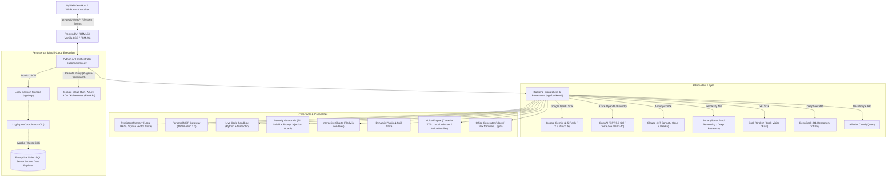

# Ignite Chat 🤖 — Enterprise Multi-Agent Platform & Multi-Cloud Assistant

Ignite Chat is a high-performance **local-first** AI desktop assistant and enterprise multi-agent platform that unifies top-tier LLM providers into a seamless, WhatsApp-style desktop interface. It is packaged for Windows via **PyWebView** + **PyInstaller**, and can optionally offload heavy compute to **Google Cloud Run (GCP)**, **Azure Container Apps (ACA)**, or **Kubernetes (K8s)** in headless serverless mode (`IGNITE_RUNTIME_MODE=remote`).

**Flagship & Active LLM Providers in Live UI Picker:** 
* **Google Gemini 2.5 (Flash & Pro Multimodal)** powered by the official `google-genai` SDK
* **DeepSeek** (Chat V4 & Reasoner R1)
* **OpenAI** (Azure AI Foundry & OpenAI Direct)
* **Anthropic Claude** (Claude 3.7 Sonnet & Opus)
* **Perplexity Sonar** (Real-Time Web Search)
* **xAI Grok** (Grok-2 & Grok-Vision)
* **Alibaba Cloud** (Qwen / DashScope) — backend module present; **UI-quarantined** (not in live picker)

**Multi-Cloud Serverless Deployment:** Desktop default is **local-first** (`IGNITE_RUNTIME_MODE=local`). Optional headless FastAPI hosting on **Google Cloud Run**, **Azure Container Apps**, or **Kubernetes** (`IGNITE_RUNTIME_MODE=remote`) is available; full thin-client hybrid remains incremental (see `docs/HYBRID_ACA.md`).  
**Session Persistence:** Local, ACID-compliant JSON files with atomic writes (`{session_id}.json`). Enterprise SQL Server and Azure Data Explorer (Kusto) exporters are available as offline ingestion tooling.

---

## 🏗️ Architectural Overview



### Key Architectural Pillars:
1. **Hybrid Webview Wrapper & DWM Integration**: WinForms host via `pywebview`. On Windows, `dwmapi.dll` via `ctypes` dynamically harmonizes the title bar and window border with system Light/Dark themes.
2. **Host OS Context Extraction**: Automatically extracts user display name, OS paths (Desktop, Downloads, Documents, Pictures), profile picture, timezone, clipboard, and system language to enrich system prompt context.
3. **Local Session JSON Persistence**: Each conversation is stored locally as `{session_id}.json` using atomic temporary file swaps (`.tmp` + `os.replace`).
4. **Enterprise Databases & Offline Exporters**: Modules in `app/Databases/` (`sql_server.py`, `kusto.py`, `coordinator.py`) provide robust offline batch ingestion into SQL Server and Azure Data Explorer with incremental offset tracking (`export_state.json`).
5. **Multi-Cloud Serverless Container Runtime (Google Cloud Run & Azure Container Apps)**: Optional remote FastAPI workers on **Cloud Run / ACA / Kubernetes** (`IGNITE_RUNTIME_MODE=remote`) with sticky `X-Ignite-Session-Id` isolation. Desktop ships **local-first**; treat full ultra-light thin-client as roadmap (`docs/HYBRID_ACA.md`), not the default install path.
6. **Group Chat Concurrency Control**: Parallel multi-AI group conversations are regulated using `AdjustableSemaphore` (controlled by `GROUP_MAX_PARALLEL`, default `3`).
7. **Multi-Panel AI Grid**: Group chats can toggle between a unified conversation stream and a synchronized multi-panel grid displaying individual thinking, search, and token metrics.

---

## 🌟 Advanced Technical Features & Capabilities

### 1. ⚡ Dynamic Real-Time Web Search & Token Optimization
* **System Prompt Tool Guidelines (`inject_tool_use_guidelines`)**: Delegates search invocation to LLM reasoning via structured prompt instructions rather than fragile keyword matching. Casual talk, math, and code generation consume **0 search tokens**.
* **Grounding Context Truncation**: Truncates search worker context history, reducing search grounding tokens by **over 95%** (from 5,000+ tokens to ~200-300 tokens per search).
* **Tenant-Scoped 403 HTTP Handling**: Detects restricted search endpoints (such as Google Custom Search 403) and disables Custom Search **only for that tenant/session namespace** (`_SEARCH_DISABLED_BY_TENANT`), not for every user on the replica.
* **User Local Timezone & Recency Filtering**: Embeds local timezone and current calendar date dynamically to steer search grounding toward real-time news articles, discarding outdated forum threads.
* **Resilient Multi-Source Web Scraper**: Scrapes top news articles (capped at 1,500 characters each) to feed clean, factual data directly to the LLM.

### 2. 🎙️ 3-Tier Speech Transcription & Hands-Free Loop
* **Tier 1 (Local Offline CPU Transcription)**: `faster-whisper` (`WhisperModel` base on CPU) runs transcription locally with **zero API cost**.
* **Tier 2 (Gemini Audio Parsing)**: Uploads raw audio bytes directly to the Gemini API for high-speed multimodal transcription if local Whisper is unavailable.
* **Tier 3 (OpenAI Whisper API)**: Cloud fallback via OpenAI `whisper-1`.
* **Instant Cancellation**: Intercepts speech queues via sequence ID (`ttsSessionId`). Clicking "Silence" flushes all queued TTS buffers immediately.

### 3. ⚡ Zero-Latency Cartesia TTS & Voice Profiles
* **Sentence-by-Sentence Queueing**: The frontend splits assistant responses into sentences. The first sentence begins playing within `~150ms`.
* **Asynchronous Prefetching**: While sentence `i` plays, sentence `i + 1` buffers in the background, eliminating inter-sentence latency.
* **Voice Profiles**: `voice_clone.py` stores reference audio profiles; production TTS is Cartesia (neural Coqui/XTTS cloning is not the shipping path).
* **Browser Fallback**: Seamlessly falls back to the Web Speech API (`speechSynthesis`) if Cartesia is unconfigured or encounters network limits.

### 4. ⏱️ Advanced Voice Activity Detection (VAD)
* **Adaptive Silence Limits**: `3000ms` for pauses within sentences (interim results) and `1800ms` for completed sentences (`isFinal`).
* **Consecutive Frame Thresholding**: Analyzes raw audio amplitude (RMS > `0.03` across 4 consecutive 50ms frames) to filter background noise.
* **Visual Debounce**: A `400ms` debounce timer eliminates HUD indicator flickering during brief pauses.

### 5. 🛡️ Security Guardrails (PII & Prompt Injection Shield)
* **PII Shield (`PIIShield`)**: Real-time regex-based redaction of emails, credit card numbers, national IDs (DNI), phone numbers, and API credentials.
* **Prompt Injection Guard (`PromptInjectionGuard`)**: Multilingual heuristic protection blocking system prompt leakage, delimiter manipulation, and jailbreak attempts (DAN-style patterns).

### 6. 🧠 Local RAG & Persistent Vector Memory
* **Autonomous Vector Storage**: SQLite-backed vector database (`local_rag.db` on desktop; `local_rag__{tenant}.db` per ACA session) with sentence embeddings and cosine similarity search for contextual knowledge retrieval.
* **Extraction Integration**: Supports structured extraction ingestion (`[IGNITE_EXTRACT]`) directly into persistent RAG collections.

### 7. 💻 Live Code Sandbox & Interactive Plotly Charts
* **Isolated Code Sandbox**: Subprocess execution sandbox with timeout limits, stdout/stderr capture, and Matplotlib figure-to-Base64 rendering.
* **Plotly.js Interactive Dashboards**: Renders responsive, standalone interactive data visualizations directly inside PyWebView via `chartRenderer.js`.

### 8. 🔌 Personal MCP Gateway & Dynamic Plugin Store
* **MCP tools (shipping):** In-process registry exposing `system_status`, `ignite_list_templates`, and `ignite_extract_file` (Ignite API bridge). Workplace connectors (Slack/Jira/…) are not shipping yet.
* **Plugin Store (`SkillLoader`)**: Dynamic hot-reloading of external `.py` extensions without restarting the application.

### 9. 📂 Intelligent Office Document Generation & Analysis
* **Intent Detection**: `detect_document_request()` classifies document creation vs. attachment analysis.
* **Programmatic Builders**: Generates styled Word (`.docx`), Excel (`.xlsx`), and PowerPoint (`.pptx`) files directly from Markdown responses.
* **Office Text Extraction**: Parses `.docx`, `.xlsx`, and `.pptx` documents locally before forwarding to non-vision models.

### 10. 💵 Dynamic Real-Time USD Cost Calculator
* **Environment-Driven Pricing Engine (`cost_calculator.py`)**: Dynamically computes input, output, and thinking token costs from `.env` rates with **zero hardcoding**.
* **Live USD Cost Tracker**: Displays real-time estimated USD session costs inside the Settings interface.

### 11. 🧭 Interactive Left Rail Dock & Multimodal Top Header
* **📞 Full-Duplex Voice Call Mode (`#voice-call-overlay`)**: Real-time hands-free voice conversations with active AI models featuring animated pulsing audio waveforms, session timers, mic mute toggles, and zero-latency Cartesia TTS stream playback.
* **📹 Vision & Screen/Camera Capture (`#vision-capture-modal`)**: Multimodal capture engine allowing 1-click desktop/window screenshot capture or live webcam snapshots directly attached to the prompt for visual reasoning.
* **🔄 System Health & API Status Dashboard (`#status-overlay-modal`)**: Live observability panel monitoring operational status, round-trip latency (ms), model versions, and lifetime token consumption across active UI providers (Alibaba UI-quarantined).
* **📢 Channels & Skill Prompts Hub (`#channels-overlay-modal`)**: Curated library of 1-click enterprise skill templates:
  - *S2S Document & Invoice Extraction* (`[IGNITE_EXTRACT]`)
  - *Excel Financial Modeling & Balance Sheet Auditing*
  - *Executive Presentation PPT Generator*
  - *Code Security, Concurrency & Refactoring Audit*
  - *Executive Correspondence & Strategic Proposals*
  - *Deep Semantic Cross-Document RAG Query*
* **👥 Multi-Agent Arena & Communities (`#communities-overlay-modal`)**: Quick management of collaborative multi-model debate panels (e.g. Gemini + DeepSeek + OpenAI collaborating).
* **📦 Document Vault & RAG Memory (`#archived-overlay-modal`)**: SQLite vector database explorer (`local_rag.db` / tenant-scoped ACA DB) enabling semantic query testing and knowledge base inspection.
* **👤 User Profile & Shortcuts (`#profile-overlay-modal`)**: Windows user context, system stats, and keyboard productivity cheat sheet.
* **🔍 In-Chat Interactive Search**: Floating search bar with instant message highlighting, match counter, and keyboard navigation (`Ctrl + F`).

### 12. ⚡ Zero-Config Setup Wizard & Hardware Self-Discovery
* **Hardware & Acceleration Auto-Diagnosis (`get_system_capabilities`)**: Automatically discovers host hardware capabilities:
  - NVIDIA CUDA GPU acceleration for local Whisper transcription
  - Tesseract OCR engine for invoice and scan parsing
  - Web Audio input / Microphone detection
  - Multi-Cloud Serverless runtime status (Google Cloud Run / Azure ACA)
* **Live API Key Validation (`validate_and_save_api_key`)**: Validates provider keys against official live endpoints in real-time and hot-reloads instances in memory with atomic `.env` updates (zero manual config file editing required).
* **Non-Intrusive Onboarding Memory**: Remembers user dismissal state in client storage (`ignite_wizard_dismissed`) while remaining accessible on-demand from the Settings drawer.

### 13. 📊 Business & Operational Productivity ROI Telemetry
* **Quantified ROI Engine (`get_productivity_metrics`)**: Translates AI usage into tangible business value:
  - *Typing & Drafting Hours Saved:* $\approx \text{words} / (40\text{ WPM} \times 60)$
  - *Document Formatting Hours Saved:* $\text{Office documents (.docx/.xlsx/.pptx)} \times 0.35\text{ hrs}$
  - *Human Labor Equivalent Cost:* $\text{Total hours saved} \times \$25.00/\text{hr}$ operational rate
  - *ROI Multiplier:* $\text{Human Equivalent Value} / \max(\text{AI Cost}, \$0.01)$
* **Interactive ROI Modal (`#roi-overlay-modal`)**: Real-time KPI dashboard tracking total deliverables, hours saved, and cost-benefit ratios.

### 14. 🤝 Human-Centric Error Recovery & Smart Fallback
* **No Dead-End Error Messages (`get_smart_fallback`)**: Replaces raw stack traces with friendly explanations when an upstream provider experiences transient outages or quota saturation (HTTP 429/503).
* **1-Click Smart Retry**: Renders interactive cards in the live chat feed allowing immediate prompt re-execution with healthy alternate providers (e.g. Gemini 2.5, DeepSeek, OpenAI) with zero re-typing friction.

### 15. 🧩 Skill-Aligned Architecture & Development Best Practices
* **Zero Secret Leakage**: All keys and endpoints are strictly consumed via environment variables and Azure Key Vault (`kvignitechat`) references.
* **Modular FSM Separation**: Frontend state is decoupled into specialized modules (`stateMachine.js`, `audio.js`, `files.js`, `chat.js`, `aiGrid.js`, `api.js`, `app.js`).
* **Multi-Path Asset Fallbacks**: Desktop binaries dynamically resolve static assets and wallpapers across root `assets/`, `_internal/assets/`, `frontend/assets/`, and PyInstaller `_MEIPASS`.
* **Universal x64 Compatibility**: Binaries compile against 64-bit architecture with NumPy 2.x shims to ensure universal execution across modern ARM64 and legacy Intel/AMD x64 machines.

---

## 🛠️ Technology Stack & Dependencies

| Library / Infrastructure | Version / Tier | Primary Purpose |
| :--- | :--- | :--- |
| **`google-genai` SDK** | `>=1.0.0` | Google Gemini 2.5 Flash & Pro multimodal & grounding engine |
| **Google Cloud Run** | Serverless (GCP) | Scalable, scale-to-zero container microservices runtime |
| **Google Cloud Build** | CI/CD (GCP) | Automated container compilation and continuous deployment |
| **`fastapi` / `uvicorn`** | `>=0.115.0` | Multi-Cloud server HTTP facade (`app/server/`) |
| **`pywebview`** | `>=5.0.0` | Native Windows GUI / WebView2 container wrapper |
| **`openai`** | `>=1.0.0` | Azure AI Foundry, OpenAI chat, DALL-E, Whisper |
| **`anthropic`** | `>=0.18.0` | Claude model family client |
| **`pydantic`** | `>=2.0.0` | Strict data transfer objects and runtime schema validation |
| **`faster-whisper`** | `>=1.0.0` | Local CPU/CUDA speech transcription |
| **`cartesia`** | `>=1.0.0` | Low-latency voice synthesis API (Sonic voices) |
| **`plotly`** | Current | Interactive chart generation & iframe rendering |
| **`python-docx` / `openpyxl` / `python-pptx`** | Current | Native Office document generation & parsing |
| **`pyodbc` / `azure-kusto-*`** | Optional | Enterprise SQL Server & ADX Kusto export sinks |
| **`beautifulsoup4` / `requests`** | Current | Web scraping and HTML parsing |

---

## 📋 Configured LLM Models & Providers

Ignite Chat supports granular versioning and temperature controls via `.env`:

| Provider | Default Model | Configured Available Versions | Env Key |
| :--- | :--- | :--- | :--- |
| **Google Gemini** | `gemini-2.5-flash` | `gemini-3.5-flash`, `gemini-3.1-pro-preview`, `gemini-2.5-pro`, `gemini-2.5-flash` | `GEMINI_MODEL_VERSION` |
| **DeepSeek** | `deepseek-v4-pro` | `deepseek-v4-pro`, `deepseek-v4-flash`, `deepseek-reasoner` | `DEEPSEEK_MODEL_VERSION` |
| **OpenAI** | `gpt-5.6-sol` | `gpt-5.6-sol`, `gpt-5.6-terra`, `o5-mini`, `gpt-4o` | `OPENAI_MODEL_VERSION` |
| **Anthropic** | `claude-fable-5` | `claude-fable-5`, `claude-opus-5`, `claude-opus-4-8`, `claude-haiku-4-5-20251001` | `ANTHROPIC_MODEL_VERSION` |
| **Perplexity** | `sonar` | `sonar`, `sonar-pro`, `sonar-reasoning-pro`, `sonar-deep-research` | `PERPLEXITY_MODEL_VERSION` |
| **xAI Grok** | `grok-4.5` | `grok-4.5`, `grok-4.3`, `grok-4.1-fast`, `grok-4-heavy` | `GROK_MODEL_VERSION` |
| **Alibaba Cloud** | `qwen-max` | `qwen-max`, `qwen-plus`, `qwen-turbo` | `ALIBABACLOUD_MODEL_VERSION` |
| **Cartesia Voice** | `sonic-3` | Sonic multi-speaker voices (Male, Female, Child, Senior in ES/EN) | `CARTESIA_API_KEY` |

---

## ⚙️ Installation & Quickstart

### Prerequisites
* **Python 3.10+** (64-bit recommended)
* **Microsoft Windows 10/11** (for WinForms container and DWM title bar styling)
* **Tesseract OCR** (optional, if `USE_LOCAL_OCR=true`)

### Setup Instructions

1. **Navigate to the application folder**:
   ```bash
   cd "Ignite API - AI Assistant/app"
   ```

2. **Create and activate a virtual environment**:
   ```powershell
   python -m venv .venv
   .venv\Scripts\Activate.ps1
   ```

3. **Install application dependencies**:
   ```bash
   pip install -r requirements.txt
   ```

4. **Configure Environment Variables**:
   ```powershell
   Copy-Item .env.example .env
   ```
   Edit `.env` to provide your API keys.

---

## 🚀 Running & Multi-Cloud Deployment

### 1. Launch Desktop Application (Local Mode)
```bash
python launcher_webview.py
```
*(Or double-click `run_app.bat` in the project root).*

### 2. Deploy Headless Server to Google Cloud Run (GCP)
```bash
# Deploy from root or app directory directly to Google Cloud Run
gcloud run deploy ignitechat \
  --source . \
  --region europe-west1 \
  --allow-unauthenticated \
  --port 8080
```
Then configure your desktop client `.env` to connect:
```env
IGNITE_RUNTIME_MODE=remote
IGNITE_BASE_URL=https://ignitechat-272154940677.europe-west1.run.app
```

### 3. Deploy to Azure Container Apps (ACA) / Kubernetes
```bash
# Run local headless container test
python -m uvicorn server.main:app --host 0.0.0.0 --port 8000
```

### 4. Build Standalone Desktop Executable
```bash
build_desktop.bat
```
* Compiles the full application with PyInstaller into `app/dist/Ignite Chat/`.
* Automatically invokes **Inno Setup 6** (`ISCC.exe`) if installed to build the single installer `IgniteChat_Setup.exe`.

---

## 📁 Project Directory Structure

```
Ignite API - AI Assistant/
├── .agents/
│   └── skills/                  # Canonical architecture specs (Coding, Core, DevOps)
├── .github/
│   └── workflows/               # CI/CD Workflows (ci.yml, deploy-aca.yml)
├── docs/
│   └── HYBRID_ACA.md            # Azure Container Apps hybrid architecture & deployment guide
├── infra/                       # Terraform / IaC provisioning templates
├── scripts/                     # Deployment automation (Deploy-IgniteChatAca.ps1, stage-aca-build.sh)
├── run_app.bat                  # Root desktop launcher shortcut
├── pyproject.toml               # Tool configuration (Ruff, Pyright, pytest)
├── pyrightconfig.json           # Pyright type-checking configuration
├── .pre-commit-config.yaml      # Code quality pre-commit hooks
├── .gitignore                   # Core Git ignore rules
└── app/
    ├── launcher_webview.py      # PyWebView host container / WinForms & DWM interop
    ├── build_desktop.bat        # PyInstaller build automation script
    ├── build_desktop_slim.bat   # Lightweight thin-client build script
    ├── setup_installer.iss      # Inno Setup 6 installer specification
    ├── enable_startup.bat       # Windows startup registry helper
    ├── crear_acceso_directo.bat # Desktop shortcut generator
    ├── Dockerfile               # Multi-stage Docker container definition
    ├── docker-compose.yml       # Local container development setup
    ├── requirements.txt         # Complete dependency list
    ├── requirements-desktop.txt # Lightweight desktop client dependencies
    ├── requirements-server.txt  # Headless server dependencies
    ├── icon.ico                 # Application system icon
    │
    ├── assets/                  # Brand assets, icons, audio, and images
    │
    ├── backend/                 # AI Core, Providers, Integrations, Tools & Voice
    │   ├── core/                # DTOs, schemas, telemetry & runtime context
    │   ├── integrations/        # External APIs (Ignite RAG transformer, S2S client, Office extractor)
    │   ├── processors/          # LLM providers (Gemini, OpenAI, Anthropic, DeepSeek, Perplexity, Grok, Alibaba)
    │   ├── tools/               # Guardrails (PII & Prompt Injection), RAG Engine, Code Sandbox, Web Agent, MCP Gateway, Plotly, Skill Loader
    │   ├── user/                # Windows OS context extraction (user, paths, display, timezone)
    │   └── voice/               # Faster-Whisper STT, Cartesia TTS, voice profile helper
    │
    ├── Databases/               # Offline enterprise exporters & vector stores
    │   ├── coordinator.py       # LogExportCoordinator CLI ingestion orchestrator
    │   ├── sql_server.py        # SQL Server exporter (pyodbc)
    │   ├── kusto.py             # Azure Data Explorer (ADX / Kusto) ingestor
    │   └── vector_store/        # Local RAG persistent SQLite vector storage
    │
    ├── frontend/                # PyWebView local HTML/CSS/JS UI assets
    │   ├── index.html           # Desktop application layout
    │   ├── css/                 # Modern responsive styling & themes
    │   └── js/                  # FSM state machine, API interop, audio VAD, Plotly charts
    │
    ├── main/                    # Desktop webview API router and document generator
    │   ├── api.py               # Main PyWebView event handling API bindings & orchestration
    │   ├── document_generator.py # Formatted Word, Excel, and PPT exporter
    │   ├── remote_api_proxy.py  # Forwarding proxy for ACA remote backend
    │   ├── env_config.py        # Multi-environment selector (.env/.staging/.prod)
    │   ├── libraries.py         # System dependencies loader
    │   └── migration.py         # Session logs file & folder schema migration
    │
    ├── plugins/                 # Extensible skill & plugin store (hot-reloadable)
    ├── server/                  # Headless FastAPI backend for Azure Container Apps
    │   ├── main.py              # Server routing & endpoints
    │   ├── auth.py              # Bearer token authentication
    │   └── session_store.py     # Multi-tenant session state isolation
    │
    └── tests/                   # Pytest unit suite (run: .venv_x64\Scripts\python.exe -m pytest app/tests/unit)
        └── unit/                # One layer only; folders match source
            ├── core/            # backend/core (+ windows_user)
            ├── frontend/        # app/frontend HTML/JS/CSS
            ├── integrations/    # Ignite API, Office extract/gen, document_request
            ├── processors/      # backend/processors
            ├── server/          # app/main/api.py, app/server/*, session, proxy
            ├── tools/           # RAG, guardrails, MCP, skill loader
            ├── voice/           # STT/TTS + mic UX
            └── results/         # pytest logs (not tests)
```

---

## 🧪 Automated Test Suite

Ignite Chat includes a comprehensive unit test suite under `app/tests/unit`, executed via:

```bash
.venv_x64\Scripts\python.exe -m pytest app/tests/unit -q
```

Target before push: **0 failed** (skipped OK). Re-count tests after suite changes; do not hardcode stale totals in docs.

```bash
# Run the complete test suite
python -m pytest app/tests/unit

# Run with verbose output and timing
python -m pytest app/tests/unit -v

# Run a specific test module
python -m pytest app/tests/unit/tools/test_rag_engine.py -v
```

> **CI/CD gate**: run the full unit suite with `.venv_x64` before push; require **0 failed** (skipped OK). Do not hardcode a stale pass count here.

### Test Coverage Summary:
* **Frontend** (`unit/frontend/`): `test_frontend_assets.py`, `test_whatsapp_file_preview.py`, `test_alibaba_ui_quarantine.py`, `test_office_file_kind_js.py`
* **Server / API** (`unit/server/`): `test_api.py`, `test_file_preview_persistence.py`, `test_productivity_and_onboarding.py`, `test_remote_api_proxy.py`, `test_server_api.py`, `test_welcome_clear_session.py`
* **Processors** (`unit/processors/`): `test_llm_processors.py`, `test_base_processor_imports.py`, `test_image_prompt_refiner.py`, `test_pdf_long_document.py`
* **Tools** (`unit/tools/`): `test_rag_engine.py`, `test_core_features.py`, `test_mcp_gateway_extraction.py`, `test_skill_loader.py`, `test_guardrails.py`
* **Integrations** (`unit/integrations/`): `test_ignite_api_client.py`, `test_ignite_extraction_integration.py`, `test_document_generator.py`, `test_document_request.py`, `test_office_extract.py`
* **Voice** (`unit/voice/`): `test_voice_processor.py`, `test_usability_and_mic_features.py`
* **Core** (`unit/core/`): `test_schemas.py`, `test_windows_user.py`, `test_telemetry.py`, `test_env_config.py`, `test_semaphore.py`, `test_runtime_user_context.py`, `test_conversation_language.py`
* **Also in server**: `test_auth.py`, `test_session_store.py`, `test_stability_fixes.py`, `test_coordinator.py` (`Databases/coordinator.py`; no `unit/databases/` folder)

---

## 🗺️ Architectural Roadmap & Skills

* 📐 **Solution Architecture Diagram (Draw.io)**: [`docs/architecture.drawio`](docs/architecture.drawio) (Editable via [app.diagrams.net](https://app.diagrams.net) or the VS Code Draw.io Integration).

The `.agents/skills/` directory defines the architectural pillars:
1. **[Coding Best Practices](.agents/skills/buenas-practicas-coding/SKILL.md)**: Strict Typing (Pydantic V2), Async-First, Frontend FSM, Zero Technical Debt.
2. **[Core Features](.agents/skills/funcionalidades-core/SKILL.md)**: Persistent Memory RAG, Personal MCP Gateway (Ignite extract tools), Code Sandbox, Web Agent (requests+BS4), Voice Profiles + Cartesia TTS, PII & Injection Shields (regex), Plotly Dashboards, Plugin Store.
3. **[IaC & DevOps](.agents/skills/iac-devops/SKILL.md)**: Containerization, Azure Container Apps, GitHub Actions CI/CD, OpenTelemetry, Multi-Environment configuration.
