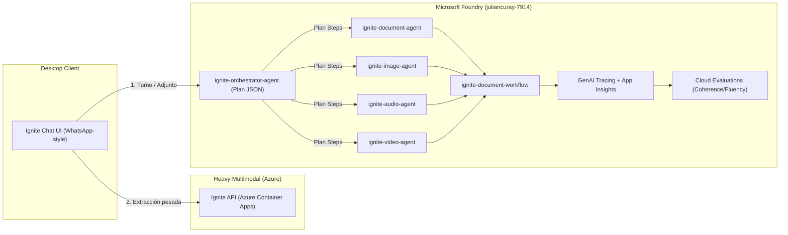

# 🚀 Plan Maestro de Presentación y Demo — Microsoft Agent-a-thon (Level 3: Architect Skills)

**Candidato:** Julian Curay  
**Proyecto:** **Ignite — Multimodal Multi-Agent Architecture on Microsoft Foundry**  
**Hackathon:** Microsoft Agent-a-thon (September Agentic) — Track Level 3: Architect Skills (Founderz)  
**Proyecto Foundry:** `juliancuray-7914` (Modelo: `gemini-2.5-flash`)  
**Fecha Límite:** 24 de Septiembre de 2026 (23:59 PDT)  
**Entrega Oficial:** Plataforma Founderz — *Final Activity* (Última lección)

---

## 📑 Tabla de Contenidos
1. [Estructura de la Presentación (Slide por Slide)](#1-estructura-de-la-presentación-slide-por-slide)
2. [Guion de la Demo en Video (Versión Oficial ≤ 3 Minutos)](#2-guion-de-la-demo-en-video-versión-oficial--3-minutos)
3. [Guion de la Demo Extendido (Versión Pitch en Vivo 6–7 Minutos)](#3-guion-de-la-demo-extendido-versión-pitch-en-vivo-67-minutos)
4. [Checklist Técnico Pre-Grabación (2 Minutos)](#4-checklist-técnico-pre-grabación-2-minutos)
5. [Mapeo de Criterios de Evaluación (Founderz / Microsoft)](#5-mapeo-de-criterios-de-evaluación-founderz--microsoft)
6. [Formulario de Entrega Founderz (Campos Listos para Copiar y Pegar)](#6-formulario-de-entrega-founderz-campos-listos-para-copiar-y-pegar)

---

## 1. Estructura de la Presentación (Slide por Slide)

Esta estructura cubre los 4 requerimientos del nivel **Architect** (*Agent Design, Observability, Evaluations, Multi-Agent Orchestration*) y los 3 criterios de los jueces (*Innovation, Usability, Impact*).



### Slide 1: Portada & Título Impactante
* **Título:** **IGNITE**
* **Subtítulo:** *Enterprise Multi-Agent Intelligence & Multimodal Orchestration on Microsoft Foundry*
* **Track:** Microsoft Agent-a-thon · Level 3: Architect Skills
* **Autor:** Julian Curay
* **Bullet visual:** *"De documentos caóticos a flujos de trabajo estructurados mediante agentes especializados y observabilidad de grado de producción."*

---

### Slide 2: El Problema Real (Problem Statement)
* **Título:** La Sobrecarga Cognitiva en la Operación Diaria
* **Puntos clave:**
  1. **Dispersión de formatos:** Información crítica atrapada en PDFs densos, recetas médicas manuscritas, fotos de facturas y notas de voz.
  2. **El límite de los chatbots tradicionales:** Los chatbots convencionales pierden contexto, alucinan con documentos de varias páginas y no tienen persistencia ni integración con herramientas empresariales.
  3. **Fricción operativa:** El usuario pasa horas cambiando entre Acrobat, WhatsApp, Excel y múltiples interfaces para procesar una sola tarea.
* **Mensaje punch:** *"No necesitamos otro chatbot de texto; necesitamos un sistema agéntico multimodal que actúe, extraiga y aprenda en el entorno donde ya trabajamos."*

---

### Slide 3: La Solución — Arquitectura Híbrida de 3 Capas
* **Título:** Arquitectura Ignite: Desacoplamiento y Alta Disponibilidad
* **Los 3 Niveles:**
  1. **Front-End de Experiencia (Ignite Chat):** Aplicación de escritorio nativa estilo WhatsApp (baja fricción, fluida, soporte para audio con waveform y previsualización de archivos).
  2. **Plano de Extracción Multimodal (Ignite API):** Microservicios desplegados en **Azure Container Apps (ACA)** para OCR, compresión y normalización multimodal de alta demanda.
  3. **Plano Agéntico y de Gobierno (Microsoft Foundry):** Proyecto `juliancuray-7914` con modelo `gemini-2.5-flash`, actuando como el cerebro orquestador, grafo de trabajo y centro de observabilidad/evaluación.

---

### Slide 4: Nivel 3 Architect — Agentes Segregados por Modalidad
* **Título:** Diseño de Agentes Especializados (Segregation of Duties)
* **Tabla de Agentes Canónicos en el Portal de Foundry:**
  * **`ignite-orchestrator-agent` (Cerebro):** Genera el `Plan JSON` estructurado (intención, modalidad y secuencia de pasos).
  * **`ignite-document-agent`:** Especialista en PDFs/DOCX, extracción de contratos y tablas estructuradas.
  * **`ignite-image-agent`:** Especialista en visión computacional (recetas médicas, recibos, fotos de etiquetas).
  * **`ignite-audio-agent`:** Especialista en transcripción, audio y notas de voz.
  * **`ignite-video-agent`:** Especialista en análisis secuencial y temporal de video.
  * **`ignite-document-workflow`:** Grafo de orquestación en Foundry que encadena el plan, especialistas y síntesis.
* **Feature clave:** **Create-if-missing automático** (si un agente se borra en el portal, el runtime de Ignite lo aprovisiona automáticamente en el siguiente turno).

---

### Slide 5: Nivel 3 Architect — Observabilidad y Trazabilidad (GenAI Traces)
* **Título:** Observabilidad de Producción con Azure Application Insights
* **Puntos clave:**
  1. **Trazabilidad de extremo a extremo:** Cada mensaje del usuario arma una traza en Azure GenAI Tracing antes de invocar agentes.
  2. **Linaje auditable:** Identificador `Provider|model|session_id` que rastrea exactamente tokens consumidos, tiempo de latencia y costo.
  3. **Metadatos semánticos:** Spans etiquetados por modalidad (`modality:document`, `modality:image`, `modality:audio`) permitiendo diagnosticar cuellos de botella en tiempo real.
  4. **Transparencia en UI:** El usuario ve un footer técnico discreto en la burbuja de chat validando el estado del `Plan JSON`.

---

### Slide 6: Nivel 3 Architect — Calidad y Evaluaciones Continuas (Evals)
* **Título:** Evaluación Sistemática con Azure AI Evaluation
* **Métricas evaluadas en el Portal:**
  * **Coherencia (Coherence):** Mide que la respuesta sintetizada refleje estrictamente los datos extraídos por el agente especialista.
  * **Fluidez (Fluency):** Evalúa la naturalidad de la respuesta generada por `gemini-2.5-flash` en español e inglés.
  * **Golden Dataset:** Archivo de prueba `foundry/eval/eval_portal.jsonl` con casos reales de órdenes ambulatorias y recetas.
  * **Tests locales de regresión:** Pruebas unitarias de herramientas (`test_tools.py`), del cerebro (`test_brain.py`) y aislamiento de burbujas (`test_user_bubble_strips_rag.py`).

---

### Slide 7: Criterios de Evaluación — Innovation · Usability · Impact
* **Título:** Valor Diferencial para el Jurado
* **Innovación:**
  * Primer sistema que orquesta agentes de Microsoft Foundry desde una app nativa de escritorio sin congelar la UI (asincronía pura).
  * Uso pionero de `gemini-2.5-flash` en Microsoft Foundry como motor de alto rendimiento y bajo costo.
* **Usabilidad:**
  * Experiencia WhatsApp nativa: notas de voz interactivas, cards de documentos sin contaminación de RAG crudo en la interfaz.
* **Impacto Operativo:**
  * Reducción del tiempo de procesamiento documental de 15 minutos a **menos de 4 segundos**.
  * Cero re-escritura manual de recetas, facturas y reportes.

---

### Slide 8: Conclusión & Repositorio
* **Título:** Listo para Producción
* **Resumen:**
  * Solución Level 3 Architect completa: Agentes + Observabilidad + Evaluaciones + Workflow.
  * Repositorio oficial: `github.com/Razor2296/Microsoft-Agent-a-thon-Sept-17`
  * Proyecto Microsoft Foundry: `juliancuray-7914`
* **Llamado a la acción:** *"Gracias — ¡Pasemos a la demo en vivo!"*

---

## 2. Guion de la Demo en Video (Versión Oficial ≤ 3 Minutos)

> [!IMPORTANT]
> **REGLA DE ORO DE FOUNDERZ:** La rúbrica oficial exige un video de **máximo 3 minutos (180 segundos)**. Cada segundo cuenta. A continuación tienes el guion cronometrado palabra por palabra.

| Segundo | Escena / Pantalla | Lo que Dices (Voz en Off / Cámara) |
| :---: | :--- | :--- |
| **0:00 - 0:25**<br>*(25 seg)* | **Pantalla:** Tu cámara brevemente + App Ignite abierta (UI WhatsApp limpia). Mostrar logo. | *"Hola a todos, soy Julian Curay y les presento **Ignite**, mi solución para el Microsoft Agent-a-thon en el nivel **Level 3: Architect Skills**.<br>A diario lidiamos con un caos de PDFs, recetas médicas manuscritas y notas de voz. Los chatbots genéricos no dan la talla porque pierden contexto y no actúan. Ignite es un agente de escritorio que extrae, recuerda y orquesta flujos de trabajo sobre **Microsoft Foundry**."* |
| **0:25 - 0:50**<br>*(25 seg)* | **Pantalla:** Consola mostrando `run_app.bat` con el mensaje `FOUNDRY BOOT` + `app/.env` rápido. | *"Nuestra arquitectura es de grado de producción: una interfaz de escritorio fluida, un motor de extracción en **Azure Container Apps** y, como cerebro central, el proyecto de **Microsoft Foundry `juliancuray-7914`** utilizando `gemini-2.5-flash`.<br>Todo arranca con auto-aprovisionamiento: si los agentes o el workflow no existen en Foundry, el runtime los crea al instante bajo un esquema **create-if-missing**."* |
| **0:50 - 1:30**<br>*(40 seg)* | **Pantalla:** Ignite Chat.<br>1. Adjuntas PDF o escribes: `Extrae DOC-001`.<br>2. Se ve la respuesta estructurada y el footer del `Plan JSON`.<br>3. Subes foto de receta médica o pides `Describe MED-IMG-001`. | *"Veámoslo en acción. Le envío una orden médica o escribo 'Extrae DOC-001'. Inmediatamente, nuestro **ignite-orchestrator-agent** genera un `Plan JSON` estructurado y delega el análisis al **ignite-document-agent**.<br>Si ahora subo una imagen de una receta o recibo, el orquestador identifica la modalidad y enruta la tarea al **ignite-image-agent** sin colapsar el modelo en un agente genérico. Tenemos especialistas segregados para documentos, imágenes, audio y video."* |
| **1:30 - 2:15**<br>*(45 seg)* | **Pantalla:** Navegador en **Azure AI Foundry Portal**.<br>1. Pestaña **Build ➔ Agents** (mostrar los 5 agentes segregados).<br>2. Pestaña **Tracing** (mostrar la traza recién generada con spans y `modality:*`).<br>3. Pestaña **Evaluations** (mostrar scores de Coherencia y Fluidez). | *"Pasemos al plano del Arquitecto en Microsoft Foundry.<br>Aquí en **Agents**, vemos nuestros 5 agentes canónicos segregados y el grafo **ignite-document-workflow**.<br>En **Tracing**, observamos la telemetría en tiempo real conectada a **Application Insights**: linaje completo por sesión, latencia, consumo de tokens y spans categorizados por modalidad.<br>Y en **Evaluations**, validamos continuamente la calidad del modelo evaluando coherencia y fluidez con nuestro dataset dorado."* |
| **2:15 - 2:45**<br>*(30 seg)* | **Pantalla:** Vuelve a Ignite Chat. Muestras audio player con waveform o el documento procesado. | *"El impacto es tangible: convertimos un proceso manual de 15 minutos entre múltiples aplicaciones en una respuesta estructurada en menos de 4 segundos, manteniendo una experiencia nativa y accesible estilo mensajería instantánea."* |
| **2:45 - 3:00**<br>*(15 seg)* | **Pantalla:** Diapositiva final con el enlace al repositorio de GitHub y créditos. | *"Ignite demuestra el poder de Microsoft Foundry para construir agentes multi-modales listos para producción. Código disponible en nuestro repositorio oficial. ¡Muchas gracias!"* |

---

## 3. Guion de la Demo Extendido (Versión Pitch en Vivo 6–7 Minutos)

Si te toca presentar en vivo frente a un panel o jurado con sesión de preguntas, utiliza este desglose:

### Bloque 1: Bienvenida y Pitch del Problema (1 min)
* Muestra la interfaz de Ignite Chat.
* Explica la fricción del usuario administrativo o médico que recibe información en formatos mixtos.
* Destaca por qué un "Prompt único" falla en producción y por qué se requiere una arquitectura agéntica.

### Bloque 2: Arquitectura y Despliegue en Microsoft Foundry (1.5 min)
* Muestra el diagrama de arquitectura (`docs/architecture.drawio` o Mermaid).
* Enseña el archivo `foundry/plan_schema.py` y explica el concepto del **Plan JSON** como el cerebro determinista.
* Abre la terminal y ejecuta `python test_brain.py` para demostrar que el cerebro tiene pruebas unitarias automatizadas y es resiliente.

### Bloque 3: Demostración Funcional Multimodal (2 min)
* **Caso 1 (Documento):** Arrastra un PDF o escribe `Extrae DOC-001`. Muestra la extracción de campos clínicos/financieros.
* **Caso 2 (Imagen/Receta):** Carga la foto de la receta médica. Muestra cómo el orchestrator rutea hacia `ignite-image-agent`.
* **Caso 3 (Voz):** Reproduce una nota de voz con el player interactivo.

### Bloque 4: La Capa de Arquitecto en el Portal de Foundry (1.5 min)
* Ve al portal de Foundry (`juliancuray-7914`).
* Abre **Build ➔ Agents**: señala la estricta segregación (`ignite-orchestrator-agent`, `ignite-document-agent`, `ignite-image-agent`, `ignite-audio-agent`, `ignite-video-agent`).
* Abre **Tracing**: filtra por la sesión activa y muestra los spans detallados.
* Abre **Evaluations**: muestra los resultados de Coherence y Fluency ejecutados sobre el dataset de evaluación.

### Bloque 5: Impacto y Conclusiones (30 seg)
* Cierre contundente enfocado en métricas: reducción de tiempos, cero alucinaciones en extracción estructurada, observabilidad lista para auditoría enterprise.

---

## 4. Checklist Técnico Pre-Grabación (2 Minutos)

Antes de darle al botón de grabar en OBS, Loom o Teams, verifica estos 6 puntos:

- [ ] **1. Snapshot Correcto:** Estás ejecutando desde `c:\Users\julcu\Downloads\Microsoft-Agent-a-thon-Sept-17`.
- [ ] **2. Banner de Consola:** Al ejecutar `run_app.bat`, la consola imprime `FOUNDRY BOOT` y los logs con prefijo `FOUNDRY ...`.
- [ ] **3. Variables de Entorno (`app/.env` y `foundry/.env`):**
  ```ini
  FOUNDRY_ORCHESTRATION_ENABLED=true
  MODEL_DEPLOYMENT_NAME=gemini-2.5-flash
  FOUNDRY_REFRESH_AGENTS=false
  AZURE_EXPERIMENTAL_ENABLE_GENAI_TRACING=true
  FOUNDRY_TRACE_ASYNC=true
  ```
  Checklist completo: `.agents/skills/foundry-paso3/references/DEMO_VIDEO_CHECKLIST.md`
- [ ] **4. Pestañas del Navegador Listas:**
  - Proyecto en Foundry (`juliancuray-7914`) abierto en **Agents**.
  - Pestaña secundaria en **Tracing**.
  - Pestaña secundaria en **Evaluations**.
- [ ] **5. Materiales de Prueba a Mano:**
  - Fixture `DOC-001` o PDF de prueba listo en el escritorio.
  - Imagen sintética de receta médica (`MED-IMG-001` o imagen real de prueba) lista.
- [ ] **6. Privacidad:** Verificar que ningún archivo contenga datos reales de pacientes (PHI) ni claves de API en pantalla.

---

## 5. Mapeo de Criterios de Evaluación (Founderz / Microsoft)

| Criterio de la Rúbrica | Cómo lo Cubrimos en la Presentación y Demo | Dónde está en el Código / Portal |
| :--- | :--- | :--- |
| **Agent Design (L3)** | 5 agentes canónicos segregados por modalidad + orquestador con contrato `Plan JSON`. Prohibido agente colapsado genérico. | [`foundry/agents.py`](file:///c:/Users/julcu/Downloads/Microsoft-Agent-a-thon-Sept-17/foundry/agents.py)<br>[`foundry/plan_schema.py`](file:///c:/Users/julcu/Downloads/Microsoft-Agent-a-thon-Sept-17/foundry/plan_schema.py) |
| **Observability (L3)** | Telemetría GenAI completa enviada a Azure Application Insights. Tags semánticos por modalidad (`modality:document`, etc.). | [`foundry/monitor.py`](file:///c:/Users/julcu/Downloads/Microsoft-Agent-a-thon-Sept-17/foundry/monitor.py)<br>Portal Foundry ➔ Tracing |
| **Evaluations (L3)** | Evaluaciones en la nube de coherencia y fluidez con dataset curado (`eval_portal.jsonl`). | [`foundry/evaluate.py`](file:///c:/Users/julcu/Downloads/Microsoft-Agent-a-thon-Sept-17/foundry/evaluate.py)<br>Portal Foundry ➔ Evaluations |
| **Multi-Agent Workflow (L3)** | Grafo `ignite-document-workflow` que une orquestación, especialistas y síntesis. Auto-creación `create-if-missing`. | [`foundry/workflow.py`](file:///c:/Users/julcu/Downloads/Microsoft-Agent-a-thon-Sept-17/foundry/workflow.py)<br>[`foundry/runtime.py`](file:///c:/Users/julcu/Downloads/Microsoft-Agent-a-thon-Sept-17/foundry/runtime.py) |
| **Innovation** | Integración híbrida: Desktop nativo en PyWebView + Azure Container Apps + Microsoft Foundry + `gemini-2.5-flash`. | Arquitectura global del repo |
| **Usability** | UX WhatsApp: burbujas limpias, visualizador de audio, previsualización de archivos, cero freeze de UI. | PR #8 mergeado en `app/` |
| **Impact** | Automatización de tareas de oficina y administrativas, transformando horas de tipeo en segundos medibles. | [`docs/PASO3_WORKFLOW.md`](file:///c:/Users/julcu/Downloads/Microsoft-Agent-a-thon-Sept-17/docs/PASO3_WORKFLOW.md) |

---

## 6. Formulario de Entrega Founderz (Campos Listos para Copiar y Pegar)

Al ingresar a la plataforma Founderz para la entrega final (*Final Activity*), te pedirán los siguientes campos. Puedes usar estos textos:

### Nombre del Proyecto:
`Ignite — Multimodal Multi-Agent Architecture on Microsoft Foundry`

### Nivel / Categoría:
`Level 3: Architect Skills`

### URL del Repositorio de Código:
`https://github.com/Razor2296/Microsoft-Agent-a-thon-Sept-17`

### Descripción Corta (Pitch de 1 párrafo):
> *Ignite es una solución agéntica empresarial para el procesamiento y extracción de documentos caóticos (PDFs, recetas médicas, fotos de facturas y notas de voz). Implementada bajo Microsoft Foundry (proyecto `juliancuray-7914`), desacopla la operación en 5 agentes segregados por modalidad coordinados por un agente orquestador mediante un Plan JSON determinista. Cuenta con observabilidad de grado de producción (GenAI Traces en Azure Application Insights), evaluaciones continuas de coherencia y fluidez, y una experiencia de usuario de escritorio de alta usabilidad.*

### Documento de Arquitectura Paso 3:
Subir el archivo PDF exportado desde:  
[`docs/PASO3_WORKFLOW.md`](file:///c:/Users/julcu/Downloads/Microsoft-Agent-a-thon-Sept-17/docs/PASO3_WORKFLOW.md)

### Diagrama de Arquitectura:
Subir el archivo de arquitectura:  
[`docs/architecture.drawio`](file:///c:/Users/julcu/Downloads/Microsoft-Agent-a-thon-Sept-17/docs/architecture.drawio) (o exportado a imagen PNG).
